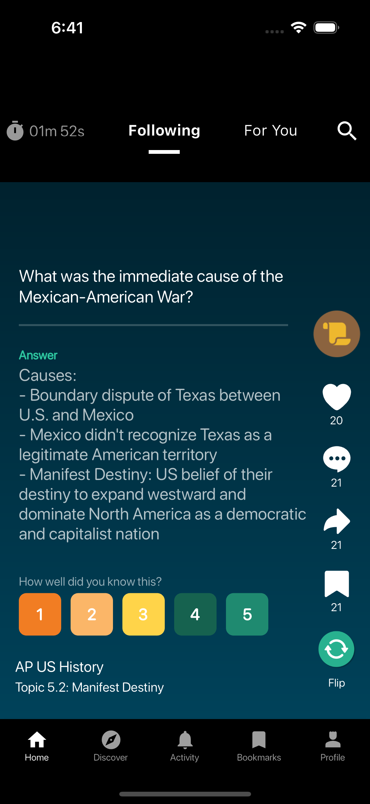

# TIKTOK CLONE APP

 This is a Crossover task that shows the implementation the “Home” screen of a TikTok clone for education.

|For You|Following|Answer|
|---|---|-----------------------------------------------------------------------------------------------------------|
||||

## Features

1. Showing content for the “Following” and “For you” sections of the “Home” screen

2. Displaying two types of content: Flashcards and Multiple Choice Questions (MCQs)

3.Showing the content’s user name,  user icon, and content description

4. Browsing through content in an infinite scroll fashion (like TikTok)

5. Making the countdown timer at the top left measure the time the user spent in the app

## Steps

1. Clone the project in the latest stable version of Flutter.

2. Open the starter project in any supported IDE of your choice.

3. Run flutter pub get && flutter run
